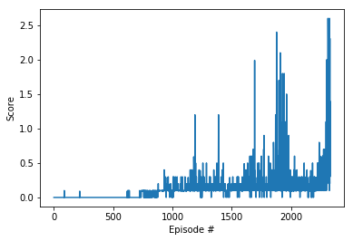

## Report

The goal of this project is to solve the Unity Tennis environment. The environment consists of two agents controlling rackets to bounce a ball over a net. The goal is for the agents to learn to controll the rackets in such a way that the ball does not fall on their side and pases over the net.

## Learning algorithm
In this solution the Deep Deterministic Policy Gradient (DDPG) algorithm is used. DDPG is based on the Advantage Actor-Critic (A2C) model. However, the Actor maps the states to actions directly, instead of outputting a probability distribution. DDPG uses 4 neural networks: 
* Deterministic policy network (Local Actor)
* Target policy network (Target Actor)
* Q network (Local Critic)
* Target Q network (Target Critic)

In order to improve stability in DDPG the target networks are stable copies of the local networks which are updated less frequently. 1

## Hyperparameters
The following values were used for the hyperparameters:
* Replay buffer size: 1e7
* Minibatch size: 256
* Discount factor gamma: 0.99
* Soft update of target parameters tau: 1e-3
* Learning rate of the actor: 1e-4
* Learning rate of the critic: 1e-3
* Weight decay: 0

## Neural network architecture
The architecture of the networks consists of 3 fully connected layers, with ReLU activations. The input to the first layer is equal to the state size (8). The hidden layer and output layer contain 256 units for the actor, and the output layer for the critic contains 128 units.

## Results
The average reward of 0.5 over the last 100 episodes was achieved after 2268 episodes with an average of 0.51. The figure below shows the plot of the rewards leading to the solution of the environment.

## Future work
This is the simplest solution to this problem, it is plausible that it could achieve better results by implementing a more complex algorithm, such as: PPO, A3C or D4PG. As well as this, implementing a multi-agent approach should provide improvments to a multi-agent problem, MADDPG could be an approach that would provide good results in this environment.

## References
1 https://towardsdatascience.com/deep-deterministic-policy-gradients-explained-2d94655a9b7b

